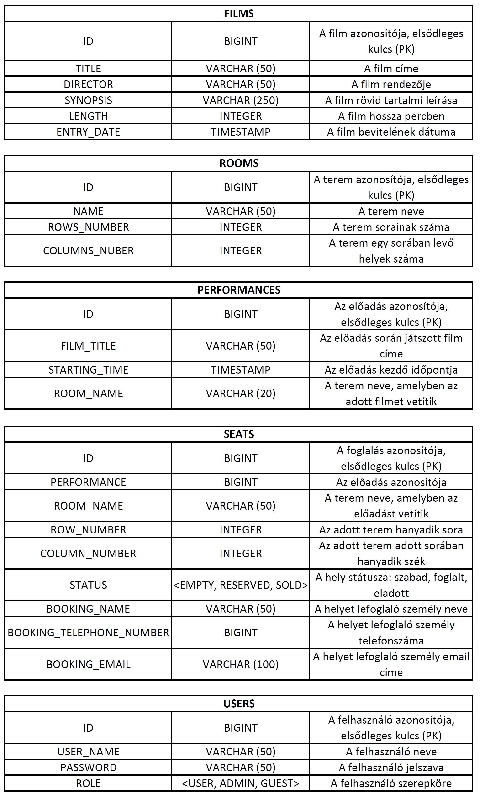
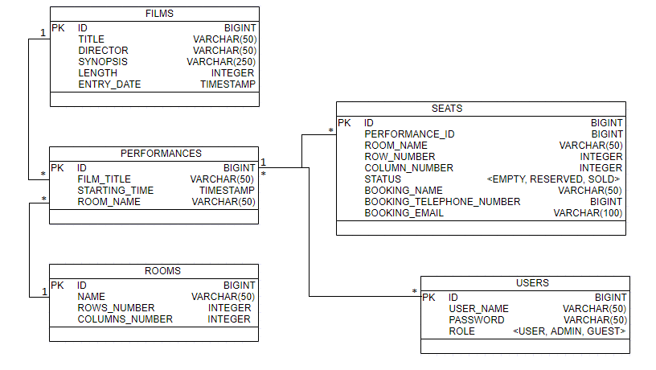
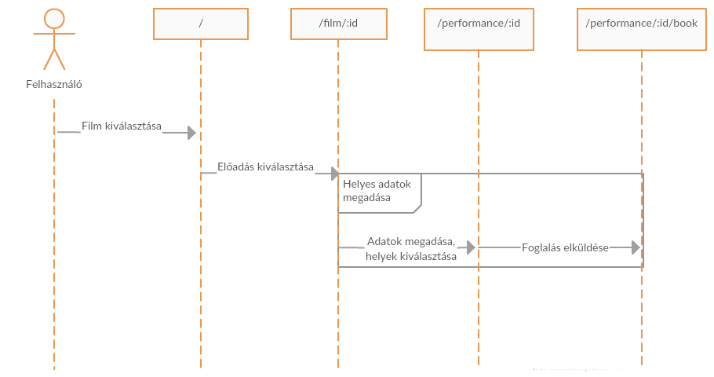
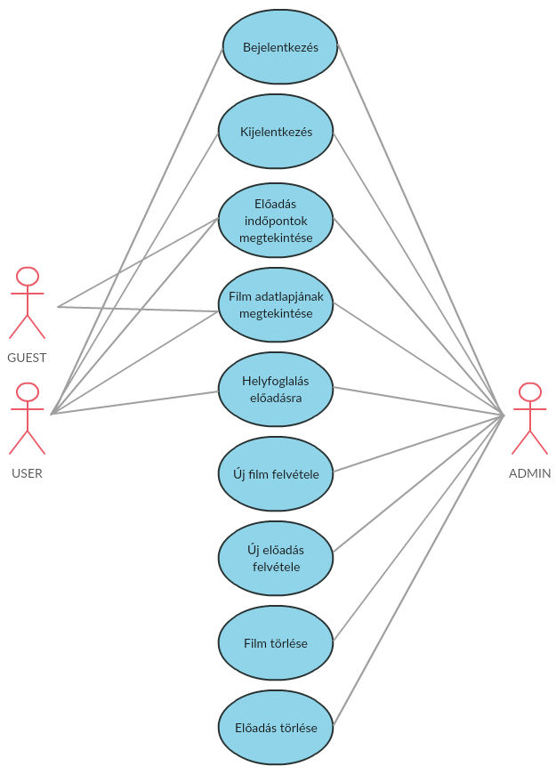

# Beadandó feladat Alkalmazások fejlesztése nevezetû tárgyra. #
### Készítette: Kelecsényi Anna és Csapó Dániel ###

## 1.Követelményanalízis ##

#### 1.1.A feladat rövid leírása: ####

Mirõl szól a projekt?
* Az alábbi projekt egy olyan program megvalósítására törekszik, amely egy multiplex mozi jegyeladásait képes kezelni. A program számos funkciói közé tartozik például a mozi által vetített filmek adatainak (cím, rendezõ, szinopszis, hossz) megtekinthetõsége; elõadás meghirdetése stb.
* A program célközönsége:

A program felhasználói egyrészt a mozi alkalmazottjai (admin), akik a program segítségével képesek elõadásokat meghirdetni adott idõpontra, valamint azokat törölhetik is. A lefoglalt, valamint a szabad helyeket ki tudják adni.

A másik felhasználói réteg (user, guest) a fentiekhez képest kevesebb funkcióval rendelkezik. Õk az elõadások kezelésére nem jogosultak, de meg tudják tekinteni, milyen filmeket vetít a mozi és mikor, stb., valamint jegyet foglalhatnak elõadásokra.

* A program számos funkciója átláthatóbbá, könnyebben kezelhetõvé teszi a jegyeladások nyilvántartását, kezelését. Ha ugyanezen adatokat papíron vezetnék a dolgozók és onnan kéne kikeresni az egyes adatokat, sokkal nehezebb dolguk lenne, valamint sokkal tovább tartana.

#### 1.2.Nem funkcionális elvárások: ####
* Felhasználóbarát, egyszerû, letisztult felület
* Keresési eredmények gyors megjelenítése
* Jelszavas azonosítás

#### 1.3.Funkcionális követelmények: ####
* A fõoldalon megjelenik a napi program, azaz mely filmeket mikor vetítik, a mozi mely termében, amit minden szerepkörû (user, admin, guest) felhasználó megtekinthet.
* A filmeket kiválasztva megjelenik annak részletes leírása (cím, rendezõ, szinopszis, hossz), valamint az összes elõadás idõpontja.
* Az idõpontot kiválasztva lehetõség nyílik helyfoglalásra az adott elõadásra. Ekkor a felhasználónak meg kell adnia a lefoglalandó hely sorszámát illetve oszlopszámát – ügyelve a terem kapacitására. Csak a szabad helyek foglalhatók le. A felhasználónak továbbá meg kell adnia nevét, telefonszámát, valamint email címét.
* Lehetõség van új film felvételére, de ezt csupán az adminisztrátor felhasználók tehetik meg. Ekkor ki kell tölteni a film adatait (cím, rendezõ, szinopszis, hossz, bevitel dátuma).
* Szintén admin szerepkörû funkcionalitás az új elõadások meghirdetése, amihez termet, filmet választva, valamint idõpont megadásával tehet meg az adminisztrátor. A meghirdetéskor ügyelni kell arra, hogy az elõadás ne ütközzön más elõadásokkal az adott teremben, illetve két elõadás között legalább 15 percnek kell eltelnie takarítás végett.
* A jegyvásárláshoz ki kell választani a filmet és az elõadást. Ezt követõen listázódnak a helyek (sor, oszlop, státusz), A szabad, illetve foglalt helyek eladhatók. A foglalt helyeket kiválasztva meg lehet tekinteni a foglaló adatait (név, telefonszám, email).

## 2.Tervezés ##

#### 2.1.Adatbázis modell: ####
   * Adatbázis sémák leírása:

   * Egyed-kapcsolat diagram:

Az ábra egyszerûsége végett a kapcsolótáblák nem szerepelnek az egyed-kapcsolat diagramon.

#### 2.2.Végpontok: ####
* GET / - Fõoldal, napi program
* GET /auth/login – Bejelentkezõ oldal
* POST /auth/login – Bejelentkezés elküldése
* POST /auth/logout – Kijelentkezés
* GET /debug – Jelenlegi felhasználó lekérdezése
* GET /film/add – Film hozzáadása oldal
* POST /film/add - Film hozzáadásának elküldése
* GET /film - Filmek listájának lekérése
* GET /film/:id – Film részletes leírása, film vetítésének idõpontjai
* GET /booking/:id Kiválasztott elõadás foglalási oldala
* POST /booking/:id/book Foglalás elküldése
* GET /film/:id/edit – Film adatainak szerkesztése
* POST /film/:id/edit Film szerkesztett adatainak elküldése
* POST /film/delete/:id – Film törlése
* GET /performance - Elõadások megtekintéése
* GET /performance/add – Elõadás hozzáadása oldal
* POST /performance/add – Elõadás hozzáadásának elküldése
* POST /performance/delete/:id - Elõadás törlése
* GET /performance/:id/edit – Elõadás szerkesztésének oldala
* POST /performance/:id/edit – Elõadás szerkesztett adatainak elküldése

    * Egy végpont részletes leírása(/performance/:id/book):

#### 2.3.Használati eset diagram (use-case modell): ####

* Guest: nem regisztrált felhasználó, a filmeket, elõadásokat megtekintheti, de pl.: jegyet nem foglalhat elõadásra.
* User: regisztrált és bejelentkezett látogató, aki már jogosult pl.: jegyfoglalásra.
* Admin: olyan felhasználó, akinek a program minden funkcionalitásához van jogosultsága.

## 3.Implementáció ##

#### 3.1.Felhasznált eszközök: ####
* Git verziókezelõ, Github a projekt közzétételéhez
* Node.js JavaScript környezet
* Angular.js TypeScript környezet
* Visual Studio Code lokális IDE

#### 3.2.Fejlesztõkörnyezet felállítása: ####
* Git verziókezelõ telepítése - Githubon történõ regisztráció ajánlott
* Node.js környezet telepítése
* Projekt klónozása lokális gépre: git clone https://github.com/kelecs08/alkfejl.git , vagy tömörített projekt letöltése és kicsomagolása, 
* A projektkönyvtárban a függõségek telepítése: npm install
* App indítása: backend-en spring-boot:run goal a pom.xml fájlon, frontend-en nmp start - alapesetben a localhost:4200-on fut a program

#### 3.3.Könyvtárstruktúra: ####
Backend:
* CinemaApplication
* annotation
    * Role
* controller
    * AuthController
    * FilmController
    * PerformanceController
    * RoomController
* entity
    * BaseEntity
    * Film
    * Performance
    * Room
    * Seat
    * User
* interceptor
    * AuthInterceptor
* repository
    * FilmRepository
    * PerformanceRepository
    * RoomRepository
    * SeatRepository
    * UserRepository
* service
    * SessionService

Frontend:
* classes
    * film
    * performance
    * room
    * seat
    * user
* components
    * addform
    * book-seat
    * delete
    * film-details
    * films
    * login
    * performance
    * register
* config
    * api
* modules
    * app-router
    * ui
* services
    * auth
    * film
    * performance
    * room
    * route-guard
    * seat
	
## 4.Felhasználói dokumentáció ##

Indítás: a backend elindítása után, az npm start parancs kiadását követõen töltsük be a böngészõben az oldalt (http://localhost:4200)

* Bejelentkezés
Bizonyos funkció eléréséhez be kell jelentkeznie a felhasználónak, melyet a jobb felsõ sarokban levõ login gombra kattintva tehet meg. Ha olyan funkciót szeretnénk elérni, amihez nincs jogosultságunk, a program átirányít a bejelentkezés oldalra.
* Filmek adatainak megtekintése
Az alkalmazás elindításakor rögtön az adatbázisban található filmek listáját láthatjuk. Egy filmcímre kattintva, az adott film részletit láthatjuk, valamint megjelennek a filmhez tartozó elõadás idõpontok.
* Elõadások adatainak megtekintése
A performances menüpontra kattintva megtekinthetjük az adatbázisban levõ elõadások adatait.
* Adminisztrátori felhasználók törölhetnek filmet, elõadást, termet
Csupán adminisztrátorin jogosultsággal törölhetünk az adatbázisból adott filmet, elõadást, vagy termet. Ehhez a funkcionalitáshoz szintén be kell jelentkezni a megfelelõ felhasználónév-jelszó párossal.

## 5.Tesztelés ##

